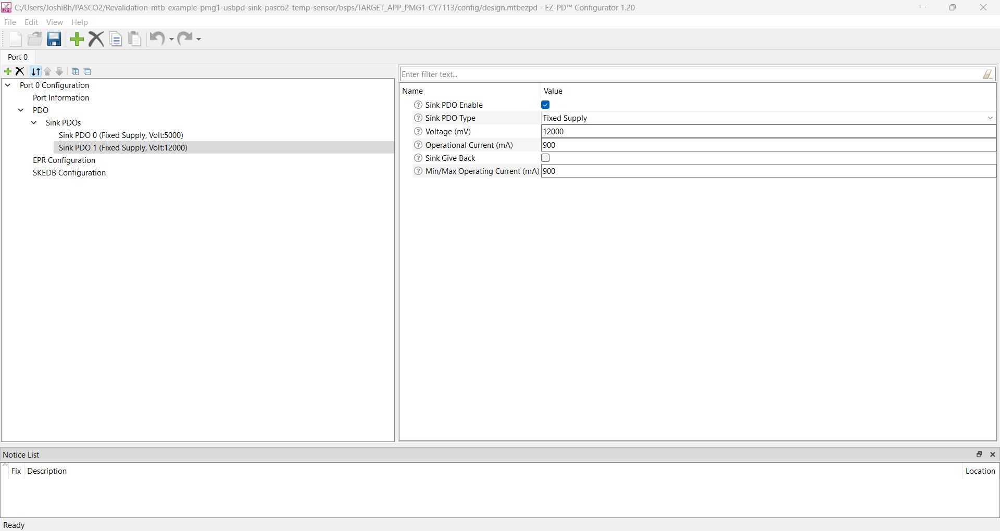

# EZ-PD&trade; PMG1 MCU: USB PD sink PAS CO2 and temperature sensor

This code example demonstrates the integration of the XENSIV&trade; PAS CO2 sensor to PMG1 devices over the I2C interface. It also demonstrates PD contract negotiation using the EZ-PD&trade; PMG1 MCU devices. The code example uses an on-chip temperature sensor to measure the temperature data. The measured CO2 level and the temperature data are sent over UART to display on a terminal.


[View this README on GitHub.](https://github.com/Infineon/mtb-example-pmg1-usbpd-sink-pasco2-temp-sensor)

[Provide feedback on this code example.](https://cypress.co1.qualtrics.com/jfe/form/SV_1NTns53sK2yiljn?Q_EED=eyJVbmlxdWUgRG9jIElkIjoiQ0UyMzk3OTEiLCJTcGVjIE51bWJlciI6IjAwMi0zOTc5MSIsIkRvYyBUaXRsZSI6IkVaLVBEJnRyYWRlOyBQTUcxIE1DVTogVVNCIFBEIHNpbmsgUEFTIENPMiBhbmQgdGVtcGVyYXR1cmUgc2Vuc29yIiwicmlkIjoiam9zaGliaCIsIkRvYyB2ZXJzaW9uIjoiMS4wLjAiLCJEb2MgTGFuZ3VhZ2UiOiJFbmdsaXNoIiwiRG9jIERpdmlzaW9uIjoiTUNEIiwiRG9jIEJVIjoiV0lSRUQiLCJEb2MgRmFtaWx5IjoiVFlQRS1DIn0=)


## Requirements


- [ModusToolbox&trade;](https://www.infineon.com/modustoolbox) v3.0 or later (tested with v3.0)
- Board support package (BSP) minimum required version: 3.0.0
- Programming language: C
- Associated parts: All [EZ-PD&trade; PMG1 MCU](https://www.infineon.com/PMG1) parts
- [XENSIV&trade; PAS CO2 sensor module (PASCO2V01)](https://www.infineon.com/co2)
- USB-C power adapter offering 12 V PDO


## Supported toolchains (make variable 'TOOLCHAIN')

- GNU Arm&reg; Embedded Compiler v10.3.1 (`GCC_ARM`) – Default value of `TOOLCHAIN`
- Arm&reg; Compiler v6.16 (`ARM`)
- IAR C/C++ Compiler v9.30.1 (`IAR`)


## Supported kits (make variable 'TARGET')

- [EZ-PD&trade; PMG1-S0 Prototyping Kit](https://www.infineon.com/CY7110) (`PMG1-CY7110`) 
- [EZ-PD&trade; PMG1-S1 Prototyping Kit](https://www.infineon.com/CY7111) (`PMG1-CY7111`)
- [EZ-PD&trade; PMG1-S2 Prototyping Kit](https://www.infineon.com/CY7112) (`PMG1-CY7112`)
- [EZ-PD&trade; PMG1-S3 Prototyping Kit](https://www.infineon.com/CY7113) (`PMG1-CY7113`) - Default value of `TARGET`


## Hardware setup

1. Connect the board to your PC using the USB cable through the KitProg3 USB Type-C port (J1). This cable is used for programming the EZ-PD&trade; PMG1 device. It is also used during debugging.

2. Connect the USB PD port (J10) to the USB-C power adapter, which offers **12 V PDO** using the USB Type-C cable. This cable is used for the USB Power Delivery source and it provides power to the user LED.

3. Connect 3V3, SCL, SDA, 12 V, PSEL, and GND of the PAS CO2 sensor module to the PMG1 kit as follows:

   PAC CO2 pin connection  | 3V3 | SCL | SDA | 12V | PSEL | GND | GND 
   :-------  | :-------  | :-------  | :-------  | :-------  | :-------  | :--------  | :--------  
   PMG1-CY7110    | J6.1 | J7.12  | J7.11 | J9+ | J6.3 | J6.3 | J9-
   PMG1-CY7111    | J6.1 | J7.6  | J7.7 | J9+ | J6.3 | J6.3 | J9-
   PMG1-CY7112    | J6.1 | J7.6  | J7.7 | J9+ | J6.3 | J6.3 | J9-
   PMG1-CY7113    | J6.1 | J7.7  | J7.6 | J9+ | J6.3 | J6.3 | J9-
     
   <br>

4. Establish the UART connections; connect the UART Tx and UART Rx lines from the PMG1 kits to J3.8 and J3.10  on KitProg3 to establish a UART connection between KitProg3 and the PMG1 devices.

   PMG1 kit UART connection  | UART Tx | UART Rx
   :-------       | :------------ | :---------- 
   PMG1-CY7110 (revision 3 or lower) | J7.7 to J3.8  | J7.6 to J3.10
   PMG1-CY7111 (revision 2 or lower) | J6.10 to J3.8 | J6.9 to J3.10
   PMG1-CY7112 (revision 2 or lower) | J6.10 to J3.8 | J6.9 to J3.10
   PMG1-CY7113 (revision 3 or lower) | J6.10 to J3.8 | J6.9 to J3.10

   <br>

For more details on configuring the board, see the kit user guide.


## Software setup

See the [ModusToolbox&trade; tools package installation guide](https://www.infineon.com/ModusToolboxInstallguide) for information about installing and configuring the tools package.

Install a terminal emulator if you don't have one. Instructions in this document use [Tera Term](https://teratermproject.github.io/index-en.html).

This example requires no additional software or tools.


## Using the code example

### Create the project

The ModusToolbox&trade; tools package provides the Project Creator as both a GUI tool and a command line tool.

<details><summary><b>Use Project Creator GUI</b></summary>

1. Open the Project Creator GUI tool.

   There are several ways to do this, including launching it from the dashboard or from inside the Eclipse IDE. For more details, see the [Project Creator user guide](https://www.infineon.com/ModusToolboxProjectCreator) (locally available at *{ModusToolbox&trade; install directory}/tools_{version}/project-creator/docs/project-creator.pdf*).

2. On the **Choose Board Support Package (BSP)** page, select a kit supported by this code example. See [Supported kits](#supported-kits-make-variable-target).

   > **Note:** To use this code example for a kit not listed here, you may need to update the source files. If the kit does not have the required resources, the application may not work.

3. On the **Select Application** page:

   a. Select the **Applications(s) Root Path** and the **Target IDE**.

   > **Note:** Depending on how you open the Project Creator tool, these fields may be pre-selected for you.

   b.	Select this code example from the list by enabling its check box.

   > **Note:** You can narrow the list of displayed examples by typing in the filter box.

   c. (Optional) Change the suggested **New Application Name** and **New BSP Name**.

   d. Click **Create** to complete the application creation process.

</details>

<details><summary><b>Use Project Creator CLI</b></summary>

The 'project-creator-cli' tool can be used to create applications from a CLI terminal or from within batch files or shell scripts. This tool is available in the *{ModusToolbox&trade; install directory}/tools_{version}/project-creator/* directory.

Use a CLI terminal to invoke the 'project-creator-cli' tool. On Windows, use the command-line 'modus-shell' program provided in the ModusToolbox&trade; installation instead of a standard Windows command-line application. This shell provides access to all ModusToolbox&trade; tools. You can access it by typing "modus-shell" in the search box in the Windows menu. In Linux and macOS, you can use any terminal application.

The following example clones the "[USB PD sink PAS CO2 and temperature sensor](https://github.com/Infineon/mtb-example-pmg1-usbpd-sink-pasco2-temp-sensor)" application with the desired name "MyUsbPdSinkPasco2TempSensor" configured for the *PMG1-CY7110* BSP into the specified working directory, *C:/mtb_projects*:

   ```
   project-creator-cli --board-id PMG1-CY7110 --app-id mtb-example-pmg1-usbpd-sink-pasco2-temp-sensor --user-app-name MyUsbPdSinkPasco2TempSensor --target-dir "C:/mtb_projects"
   ```

The 'project-creator-cli' tool has the following arguments:

Argument | Description | Required/optional
---------|-------------|-----------
`--board-id` | Defined in the <id> field of the [BSP](https://github.com/Infineon?q=bsp-manifest&type=&language=&sort=) manifest | Required
`--app-id`   | Defined in the <id> field of the [CE](https://github.com/Infineon?q=ce-manifest&type=&language=&sort=) manifest | Required
`--target-dir`| Specify the directory in which the application is to be created if you prefer not to use the default current working directory | Optional
`--user-app-name`| Specify the name of the application if you prefer to have a name other than the example's default name | Optional

> **Note:** The project-creator-cli tool uses the `git clone` and `make getlibs` commands to fetch the repository and import the required libraries. For details, see the "Project creator tools" section of the [ModusToolbox&trade; tools package user guide](https://www.infineon.com/ModusToolboxUserGuide) (locally available at {ModusToolbox&trade; install directory}/docs_{version}/mtb_user_guide.pdf).

</details>


### Open the project

After the project has been created, you can open it in your preferred development environment.


<details><summary><b>Eclipse IDE</b></summary>

If you opened the Project Creator tool from the included Eclipse IDE, the project will open in Eclipse automatically.

For more details, see the [Eclipse IDE for ModusToolbox&trade; user guide](https://www.infineon.com/MTBEclipseIDEUserGuide) (locally available at *{ModusToolbox&trade; install directory}/docs_{version}/mt_ide_user_guide.pdf*).

</details>


<details><summary><b>Visual Studio (VS) Code</b></summary>

Launch VS Code manually, and then open the generated *{project-name}.code-workspace* file located in the project directory.

For more details, see the [Visual Studio Code for ModusToolbox&trade; user guide](https://www.infineon.com/MTBVSCodeUserGuide) (locally available at *{ModusToolbox&trade; install directory}/docs_{version}/mt_vscode_user_guide.pdf*).

</details>


<details><summary><b>Keil µVision</b></summary>

Double-click the generated *{project-name}.cprj* file to launch the Keil µVision IDE.

For more details, see the [Keil µVision for ModusToolbox&trade; user guide](https://www.infineon.com/MTBuVisionUserGuide) (locally available at *{ModusToolbox&trade; install directory}/docs_{version}/mt_uvision_user_guide.pdf*).

</details>


<details><summary><b>IAR Embedded Workbench</b></summary>

Open IAR Embedded Workbench manually, and create a new project. Then select the generated *{project-name}.ipcf* file located in the project directory.

For more details, see the [IAR Embedded Workbench for ModusToolbox&trade; user guide](https://www.infineon.com/MTBIARUserGuide) (locally available at *{ModusToolbox&trade; install directory}/docs_{version}/mt_iar_user_guide.pdf*).

</details>


<details><summary><b>Command line</b></summary>

If you prefer to use the CLI, open the appropriate terminal, and navigate to the project directory. On Windows, use the command-line 'modus-shell' program; on Linux and macOS, you can use any terminal application. From there, you can run various `make` commands.

For more details, see the [ModusToolbox&trade; tools package user guide](https://www.infineon.com/ModusToolboxUserGuide) (locally available at *{ModusToolbox&trade; install directory}/docs_{version}/mtb_user_guide.pdf*).

</details>


## Operation


1. Complete the steps listed in the [Hardware setup](#hardware-setup) section.

2. Ensure that the jumper shunt on power selection jumper (J5) is placed at position 2-3 while programming the kit.

3. Program the board using one of the following:

   <details><summary><b>Using Eclipse IDE</b></summary>

      1. Select the application project in the Project Explorer.

      2. In the **Quick Panel**, scroll down, and click **\<Application Name> Program (KitProg3_MiniProg4)**.
   </details>


   <details><summary><b>In other IDEs</b></summary>

   Follow the instructions in your preferred IDE.
   </details>


   <details><summary><b>Using CLI</b></summary>

     From the terminal, execute the `make program` command to build and program the application using the default toolchain to the default target. The default toolchain is specified in the application's Makefile but you can override this value manually:
      ```
      make program TOOLCHAIN=<toolchain>
      ```

      Example:
      ```
      make program TOOLCHAIN=GCC_ARM
      ```
   </details>

4. After programming the kit, change the position on power selection jumper (J5) to 1-2 to power the kit through the USB PD port. Do not change the jumper (J5) position while the cables are connected to the power source.

5. Open a terminal program and select the KitProg3 COM port. Set the serial port parameters to 8N1 and 115200 baud.

6. Connect the USB Type-C connector (J10) on the kit to a USB PD source which offers 12 V PDO via a second USB Type-C to Type-C cable. This will also power on the PAS CO2 sensor module with 3.3 V on its 3v3 pin and 12 V on its 12 V pin.

7. Observe the user LED (LED3) on the board blink at different rates depending on the type of power adapter connected:

    - If a power adapter supporting USB Power Delivery is connected, the LED blinks at about 5 Hz (toggles every 100 ms).
    - If a USB Type-C power adapter or a standard downstream port (SDP) is connected, the LED blinks at about 1 Hz (toggles every 500 ms).
    - If a dedicated charging port (DCP) is connected, the LED blinks at about 0.17 Hz (toggles every 3 seconds).
    - If a charging downstream port (CDP) is connected, the LED blinks at about 0.05 Hz (toggles every 10 seconds).

8. The application will start printing PAS CO2 sensor initialization status, and the measured CO2 level and on chip temperature data every ten seconds.

> **Note:** An offset (TIMER_OFFSET_MSEC) has been added to the timer period to avoid conflict between record and read of PAS CO2 sensor measurements. The XENSIV PAS CO2 sensor records CO2 data every 10 seconds.

## Debugging

You can debug the example to step through the code.


<details><summary><b>In Eclipse IDE</b></summary>

Use the **\<Application Name> Debug (KitProg3_MiniProg4)** configuration in the **Quick Panel**. For details, see the "Program and debug" section in the [Eclipse IDE for ModusToolbox&trade; user guide](https://www.infineon.com/MTBEclipseIDEUserGuide).


</details>


<details><summary><b>In other IDEs</b></summary>

Follow the instructions in your preferred IDE.
</details>

Ensure that the board is connected to your PC using the USB cable through the KitProg3 USB connector and that the jumper shunt on the power selection jumper (J5) is placed at position 1-2. See the "Debug mode" Section in the kit user guide.


## Design and implementation


This application uses the PDStack middleware library in an upstream facing port (UFP)-sink configuration. The EZ-PD&trade; PMG1 MCU devices have a dead-battery Rd termination, which ensures that a USB-C source/charger connected to it can detect the presence of a sink even when the EZ-PD&trade; PMG1 MCU device is not powered.

**Figure 1. Firmware flowchart**


<br>

For more information on PDStack middleware library, see [EZ-PD&trade; PMG1 MCU: USBPD sink](https://github.com/Infineon/mtb-example-pmg1-usbpd-sink).

In addition to PDStack library initialization, the code also initializes the following blocks upon reset:

1. SCB1 is initialized as UART to output debug messages and sensor data. To implement the UART data transfer on the SCB hardware block, the UART Peripheral Driver Library APIs are used. The UART is initialized with the following settings:

	- Baud rate: 115200

	- Data width: 8 bits

	- Parity: None

	- Stop bit: 1

	- The clock input of the block is connected to a 12 MHz PERI-derived clock.
	
   **Figure 2. UART SCB in Device Configurator**

   

   <br>

2. SCB0 is initialized as an I2C Master to communicate with the PAS CO2 sensor. To implement the I2C master on the SCB hardware block, I2C Peripheral Driver Library APIs are used. The I2C Master peripheral is initialized with the following settings:

	- Data rate: 400 kbps

	- The clock input of the block is connected to a 12 MHz PERI-derived clock.
	
   **Figure 3. I2C SCB in Device Configurator**

   

   <br>

3. The TCPWM block is configured as a counter and is initialized to trigger an interrupt every two seconds for initialization and every TIMER_PERIOD_MSEC for measurements. The firmware sets a flag to measure the PAS CO2 sensor data when the interrupt is triggered. The TCPWM peripheral is configured with the following settings:

	- Counter period: N-1 

	- Triggers interrupt upon overflow or underflow of the counter

	- The clock input to the block is connected to 12 MHz PERI-derived clock with divider setting for 1 kHz.

   **Figure 4. TCPWM block in Device Configurator**

   
   
   <br>

The PDStack middleware library configures the USB PD block on the EZ-PD&trade; PMG1 MCU device to detect Type-C connection state changes and USB PD messages, and notify the stack through callback functions. The callback function registers the pending tasks, which are then handled by PDStack through the `Cy_PdStack_Dpm_Task` function. This function is expected to be called at appropriate times from the main processing loop of the application.

For more information on PDStack tasks, see [EZ-PD&trade; PMG1 MCU: USBPD sink](https://github.com/Infineon/mtb-example-pmg1-usbpd-sink).

**Figure 5. UART terminal with sensor data**


### Compile-time configurations

The EZ-PD&trade; PMG1 MCU USBPD sink application functionality can be customized through a set of compile-time parameters that can be turned on or off through the *config.h* header file.

**Table 1. Compile-time configurations**


 Macro name          | Description                           | Allowed values 
 :------------------ | :------------------------------------ | :------------- 
 `CY_PD_SINK_ONLY`     | Specifies that the application supports only the USBPD sink (consumer) role | Set to 1u 
 `NO_OF_TYPEC_PORTS`   | Specifies the number of USB-C ports supported | Set to 1u 
 `CY_PD_REV3_ENABLE`   | Enable USBPD Revision 3.0 support | 1u or 0u 
 `PD_PDO_SEL_ALGO`     | Specifies the algorithm to use while selecting the best source capability to power the board | 0u - Pick the source PDO delivering the maximum amount of power <br> 1u - Pick the fixed source PDO delivering the maximum amount of power <br> 2u - Pick the fixed source PDO delivering the maximum amount of current <br> 3u - Pick the fixed source PDO delivering the maximum amount of voltage 
 `VBUS_FET_CTRL`       | Selects the gate driver to use to turn the consumer power path on (applicable only for CY7110) | 0u - Gate driver which does not support internal pull-up <br> 1u - Gate driver which supports pull-up for faster turn off 
 `BATTERY_CHARGING_ENABLE` | Enables BC 1.2 (CDP/DCP) detection when connected to a non-USBPD power source | 1u or 0u 
 `SNK_STANDBY_FET_SHUTDOWN_ENABLE` | Specifies whether the consumer power path should be disabled while PD contracts are being negotiated | 1u or 0u 
 `SYS_DEEPSLEEP_ENABLE` | Enables device entry into Deep Sleep mode for power saving when the CPU is idle | 1u or 0u 
 `APP_FW_LED_ENABLE` | Enables toggling of the user LED (LED3) based on the type of power source | 1u or 0u 
 `DEBUG_PRINT` | Debug print macro to enable UART print | 1u or 0u 
 `ENABLE_PASCO2_I2C_INTERFACE` | Enables all the application code required to handle the PAS CO2 sensor | 1u or 0u 

<br>

### USB PD port configuration

The properties of the USB-C port including port role and the default response to various USBPD messages can be configured using the EZ-PD&trade; Configurator utility.

These parameters have been set to the appropriate values for a Power Delivery sink application by default. To view or change the configuration, click on the **EZ-PD&trade; Configurator 1.20** item under **Tools** in the **Quick Panel** to launch the configurator. A 12 V Sink PDO has been configured to provide **12 V PDO** supply to the XENSIV&trade; PAS CO2 sensor.

**Figure 6. Sink 12V capability configuration in EZ-PD&trade; Configurator**



<br>

For details on how to configure the various sink capabilities of the USB-C port, see [EZ-PD&trade; PMG1 MCU: USBPD sink](https://github.com/Infineon/mtb-example-pmg1-usbpd-sink).

Once the parameters have been updated as desired, save the configuration and build the application.

For quick verification of the application configurability, disable the **PD Operation** parameter under **Port Information**. When the EZ-PD&trade; PMG1 MCU device is programmed with this modification, you can see that the user LED blinks at a slower rate even when connected to a power source that supports USB Power Delivery.


### Resources and settings

**Table 2. Application resources**

 Resource  |  Alias/object     |    Purpose
 :-------- | :-------------    | :------------
 USBPD     	| PD_PORT0       | USBPD block used for PD communication
 LED (BSP) 	| CYBSP_USER_LED | User LED to indicate connection state
 SCB0		| I2C			 | I2C block used for communication with the PAS CO2 sensor
 SCB1		| UART			 | UART block used to send debug message via terminal
 TCPWM		| CYBSP_TIMER	 | Counter block used to trigger interrupt every XENSIV_PASCO2_FCS_MEAS_RATE_S seconds for sensor data measurement

<br>

**Table 3. List of application files and their usage**

 File                         | Purpose
 :--------------------------- | :------------------------------------
 *src/app/app.c & .h*                | Defines data structures and function prototypes and implements functions to handle application-level USB Type-C and PD events 
 *src/app/charger_detect.c & .h*     | Defines data structures and function prototypes and implements functions to handle BC 1.2 charger detection 
 *src/app/fault_handlers.c*          | Implements functions to handle the various faults related to USB Type-C and PD 
 *src/app/pdo.c & .h*                | Defines function prototypes and implements functions to evaluate source capabilities (power data object)
 *src/app/psink.c & .h*              | Defines function prototypes and implements functions for power consumer path control
 *src/app/swap.c & .h*               | Defines function prototypes and implements functions to evaluate the USBPD role swap requests
 *src/app/vdm.c & .h*                | Defines data structures and function prototypes and implements functions to handle vendor defined messages (VDM)
 *src/system/instrumentation.c & .h* | Defines data structures and function prototypes and implements functions to monitor CPU resource usage
 *src/app/i2c_master.c & .h* 		 | Defines data structures and function prototypes and implements functions to perform I2C read and write to the PAS CO2 sensor
 *src/app/xensiv_pasco2_platform.h*  | Defines PAS CO2 sensor driver platform dependencies
 *src/app/xensiv_pasco2_regs.h*      | Defines registers for interacting with the PAS CO2 sensor
 *src/app/xensiv_pasco2.c & .h*      | Defines data structures and function prototypes and implements functions to read and write various PAS CO2 registers, calculate CO2 level co-efficients, configure the sampling rates, and receive the measured CO2 level data from PAS CO2

<br>

## Related resources

Resources  | Links
-----------|----------------------------------
Application notes  | [AN232553](https://www.infineon.com/an232553) – Getting started with EZ-PD&trade; PMG1 MCU on ModusToolbox&trade; <br> [AN232565](https://www.infineon.com/an232565) – EZ-PD&trade; PMG1 MCU hardware design guidelines and checklist
Code examples  | [Using ModusToolbox&trade;](https://github.com/Infineon/Code-Examples-for-ModusToolbox-Software) on GitHub
Device documentation | [EZ-PD&trade; PMG1 MCU datasheets](https://www.infineon.com/PMG1DS)
Development kits | Select your kits from the [Evaluation board finder](https://www.infineon.com/cms/en/design-support/finder-selection-tools/product-finder/evaluation-board)
Libraries on GitHub  | [mtb-pdl-cat2](https://github.com/Infineon/mtb-pdl-cat2) – Peripheral Driver Library (PDL) and documents
Middleware on GitHub  | [pdstack](https://github.com/Infineon/pdstack) – PDStack middleware library and documents <br> [pdutils](https://github.com/Infineon/pdutils) – PDUtils middleware library and documents
Tools  | [ModusToolbox&trade;](https://www.infineon.com/modustoolbox) – ModusToolbox&trade; software is a collection of easy-to-use libraries and tools enabling rapid development with Infineon MCUs for applications ranging from wireless and cloud-connected systems, edge AI/ML, embedded sense and control, to wired USB connectivity using PSoC&trade; Industrial/IoT MCUs, AIROC&trade; Wi-Fi and Bluetooth&reg; connectivity devices, XMC&trade; Industrial MCUs, and EZ-USB&trade;/EZ-PD&trade; wired connectivity controllers. ModusToolbox&trade; incorporates a comprehensive set of BSPs, HAL, libraries, configuration tools, and provides support for industry-standard IDEs to fast-track your embedded application development.

<br>


## Other resources

Infineon provides a wealth of data at [www.infineon.com](https://www.infineon.com) to help you select the right device, and quickly and effectively integrate it into your design.


## Document history

Document title: *CE239791* – *EZ-PD&trade; PMG1 MCU: USB PD sink PAS CO2 and temperature sensor*

 Version | Description of change
 ------- | ---------------------
 1.0.0   | New code example
<br>


All referenced product or service names and trademarks are the property of their respective owners.

The Bluetooth&reg; word mark and logos are registered trademarks owned by Bluetooth SIG, Inc., and any use of such marks by Infineon is under license.


---------------------------------------------------------

© Cypress Semiconductor Corporation, 2024. This document is the property of Cypress Semiconductor Corporation, an Infineon Technologies company, and its affiliates ("Cypress").  This document, including any software or firmware included or referenced in this document ("Software"), is owned by Cypress under the intellectual property laws and treaties of the United States and other countries worldwide.  Cypress reserves all rights under such laws and treaties and does not, except as specifically stated in this paragraph, grant any license under its patents, copyrights, trademarks, or other intellectual property rights.  If the Software is not accompanied by a license agreement and you do not otherwise have a written agreement with Cypress governing the use of the Software, then Cypress hereby grants you a personal, non-exclusive, nontransferable license (without the right to sublicense) (1) under its copyright rights in the Software (a) for Software provided in source code form, to modify and reproduce the Software solely for use with Cypress hardware products, only internally within your organization, and (b) to distribute the Software in binary code form externally to end users (either directly or indirectly through resellers and distributors), solely for use on Cypress hardware product units, and (2) under those claims of Cypress's patents that are infringed by the Software (as provided by Cypress, unmodified) to make, use, distribute, and import the Software solely for use with Cypress hardware products.  Any other use, reproduction, modification, translation, or compilation of the Software is prohibited.
<br>
TO THE EXTENT PERMITTED BY APPLICABLE LAW, CYPRESS MAKES NO WARRANTY OF ANY KIND, EXPRESS OR IMPLIED, WITH REGARD TO THIS DOCUMENT OR ANY SOFTWARE OR ACCOMPANYING HARDWARE, INCLUDING, BUT NOT LIMITED TO, THE IMPLIED WARRANTIES OF MERCHANTABILITY AND FITNESS FOR A PARTICULAR PURPOSE.  No computing device can be absolutely secure.  Therefore, despite security measures implemented in Cypress hardware or software products, Cypress shall have no liability arising out of any security breach, such as unauthorized access to or use of a Cypress product. CYPRESS DOES NOT REPRESENT, WARRANT, OR GUARANTEE THAT CYPRESS PRODUCTS, OR SYSTEMS CREATED USING CYPRESS PRODUCTS, WILL BE FREE FROM CORRUPTION, ATTACK, VIRUSES, INTERFERENCE, HACKING, DATA LOSS OR THEFT, OR OTHER SECURITY INTRUSION (collectively, "Security Breach").  Cypress disclaims any liability relating to any Security Breach, and you shall and hereby do release Cypress from any claim, damage, or other liability arising from any Security Breach.  In addition, the products described in these materials may contain design defects or errors known as errata which may cause the product to deviate from published specifications. To the extent permitted by applicable law, Cypress reserves the right to make changes to this document without further notice. Cypress does not assume any liability arising out of the application or use of any product or circuit described in this document. Any information provided in this document, including any sample design information or programming code, is provided only for reference purposes.  It is the responsibility of the user of this document to properly design, program, and test the functionality and safety of any application made of this information and any resulting product.  "High-Risk Device" means any device or system whose failure could cause personal injury, death, or property damage.  Examples of High-Risk Devices are weapons, nuclear installations, surgical implants, and other medical devices.  "Critical Component" means any component of a High-Risk Device whose failure to perform can be reasonably expected to cause, directly or indirectly, the failure of the High-Risk Device, or to affect its safety or effectiveness.  Cypress is not liable, in whole or in part, and you shall and hereby do release Cypress from any claim, damage, or other liability arising from any use of a Cypress product as a Critical Component in a High-Risk Device. You shall indemnify and hold Cypress, including its affiliates, and its directors, officers, employees, agents, distributors, and assigns harmless from and against all claims, costs, damages, and expenses, arising out of any claim, including claims for product liability, personal injury or death, or property damage arising from any use of a Cypress product as a Critical Component in a High-Risk Device. Cypress products are not intended or authorized for use as a Critical Component in any High-Risk Device except to the limited extent that (i) Cypress's published data sheet for the product explicitly states Cypress has qualified the product for use in a specific High-Risk Device, or (ii) Cypress has given you advance written authorization to use the product as a Critical Component in the specific High-Risk Device and you have signed a separate indemnification agreement.
<br>
Cypress, the Cypress logo, and combinations thereof, ModusToolbox, PSoC, CAPSENSE, EZ-USB, F-RAM, and TRAVEO are trademarks or registered trademarks of Cypress or a subsidiary of Cypress in the United States or in other countries. For a more complete list of Cypress trademarks, visit www.infineon.com. Other names and brands may be claimed as property of their respective owners.
